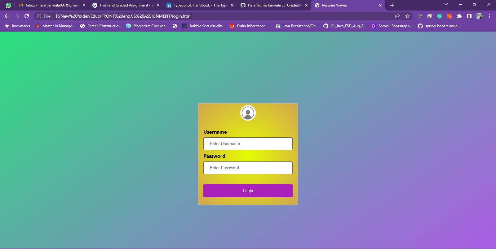

# HarshkumarJariwala_JS_GradedProject2
## Description

Candidate CV stack is a web application where the candidates are saved and can be search for suitable jobs vacancies at company. The application provides Candidate catalogue and information which helps the emploers to decide which candidate to select.

The 3 user roles are one , two and three
passwords are ONE, TWO and THREE for respective user.

### Employer
* Can search for candidates based on different Position/Job
* Can check the details of filtered candidates
* Can Move to Next/Previous Candidate, if there is more than one candidate shorted by given buttons.
* Alert of No data found will happen if there is no match. 

## Tech Stack

* JSON
* HTML / CSS
* Javascript

## Screenshot 

